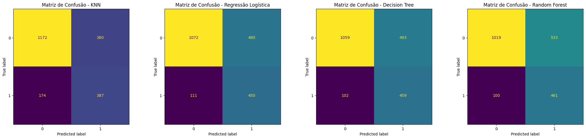

# 🤖 Previsão e Análise de Churn — TelecomX ML

Este projeto aplica modelos de machine learning para prever a evasão de clientes em uma operadora fictícia de telecomunicações (TelecomX), identificando variáveis-chave e propondo estratégias de retenção baseadas em dados.

---

## 📊 Sobre o Projeto

- **Objetivo:** Identificar clientes em risco de churn e entender os principais fatores que levam ao cancelamento.
- **Base:** Mais de 7.000 clientes; ~25% de churn identificado.
- **Tecnologias:** Python, Pandas, Scikit-learn, Imbalanced-learn, Matplotlib, Seaborn.

---

## ⚙️ Pipeline e Modelos

- **Tratamento de dados:** Limpeza, encoding (OneHot/Label), normalização e balanceamento (SMOTE).
- **Seleção de variáveis:** Identificação dos fatores mais relevantes via Random Forest e análise dos coeficientes da Regressão Logística.
- **Modelos testados:**
    - Decision Tree 🌳
    - Random Forest 🌲
    - Regressão Logística 📦
    - KNN 👥
- **Métricas utilizadas:** Acurácia, precisão, recall, F1-score, matriz de confusão.

---

## 🔑 Fatores-Críticos para o Churn

- ⏳ **Tenure (tempo de permanência):** Clientes novos têm risco elevado de evasão.
- 💵 **Charges.Total (valor acumulado):** Valores baixos normalmente refletem clientes recém-chegados, mais vulneráveis ao churn.
- 🏷️ **Charges.Monthly (mensalidade baixa):** Clientes de planos básicos tendem a cancelar com mais facilidade.
- Contrato mensal, pouco uso de serviços agregados e ausência de suporte técnico também contribuem com menor impacto.

---

## 🏆 Resultados & Recomendações

- **Desempenho dos modelos:**  
    - Árvores (Decision Tree/Random Forest): Maior recall — identificam mais casos de churn, sacrificando a precisão.
    - Regressão Logística: Melhor equilíbrio entre recall e precisão, com alta interpretabilidade.
    - KNN: Performance mais modesta, mas melhora com seleção das variáveis relevantes.
- **Principais estratégias sugeridas:**
    - 📅 Engajamento intensivo para clientes recentes.
    - 🔄 Ofertas e bônus para estimular migração a contratos mais longos.
    - ✉️ Ações educativas e de valor para clientes de planos básicos/baixo uso.
    - 📢 Monitoramento automatizado via CRM para acionar times de retenção.

---

## 📊 Comportamento dos Modelos — Matrizes de Confusão

A figura abaixo mostra, lado a lado, o desempenho dos modelos KNN, Regressão Logística, Decision Tree e Random Forest, facilitando a comparação do poder de acerto e dos erros de cada abordagem ao prever churn:



---

## 🚀 Como Executar o Projeto

1. Clone este repositório:
   ```bash
   git clone https://github.com/diegobremer/TelecomX_parte2.git
2. Abra o notebook `TelecomX_BR_parte2.ipynb` no Google Colab (ou em outro ambiente de sua preferência).

3. Execute as células sequencialmente para reproduzir a análise e os resultados.

> O arquivo de dados `dados_tratados.csv` é carregado automaticamente do repositório GitHub dentro do notebook via URL, não havendo necessidade de upload manual ou download extra.

## 📌 Autor

**Diego Bremer**
Se tiver sugestões ou dúvidas, fique à vontade para abrir uma issue ou entrar em contato via GitHub!
